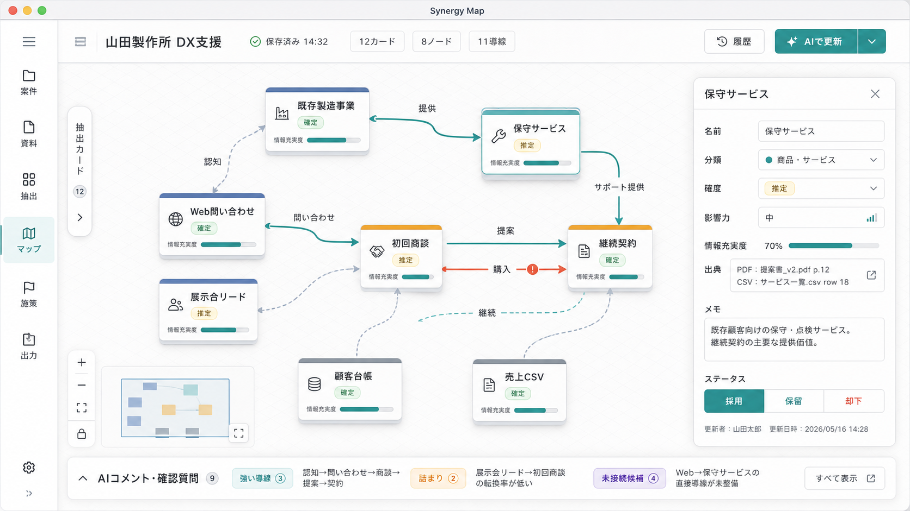

# MVP-1 UIデザイン仕様

作成日: 2026-05-16

## 参照画像



この画像をMVP-1のUI基準にする。完全なピクセル再現ではなく、React / CSS / React Flowで安定して再現できる構造、密度、色、状態表現を優先する。

## デザイン方針

- 業務用の作業台として設計する。
- シナジーマップを主役にし、周辺UIは必要な時だけ開く。
- 装飾よりも、資料確認、AI抽出確認、会議中の軽い編集を優先する。
- 2.5D表現はシナジーマップ内に限定する。
- アプリ全体はフラットで静かなUIにする。
- 見た目は立体的でも、操作モデルは2Dのままにする。

## 画面構成

MVP-1の標準画面は以下のレイアウトを基本にする。

| 領域 | 目安サイズ | 内容 |
| --- | ---: | --- |
| 左ナビ | 64px | 主要ビュー切り替え |
| トップバー | 56px | 案件名、保存状態、件数、主要アクション |
| メインキャンバス | 残り全体 | シナジーマップ、資料投入、一覧ビューなど |
| 折りたたみ左トレイ | 36px閉 / 320px開 | 抽出カード、source chunks |
| 右インスペクター | 300px前後 | 選択中ノード、カード、導線の編集 |
| 下部ドロワー | 44px閉 / 240px開 | AIコメント、確認質問、施策候補 |

## ナビゲーション

左ナビは細いアイコンレールにする。

| 表示名 | 用途 |
| --- | --- |
| 案件 | 案件一覧、案件詳細 |
| 資料 | ファイル投入、source chunks確認 |
| 抽出 | AI抽出カード確認 |
| マップ | シナジーマップ生成、確認、編集 |
| 施策 | AIコメント、施策カード、確認質問 |
| 出力 | Markdown / CSV / PDF出力 |

ナビ項目はアイコン + 2文字程度の日本語ラベルにする。選択状態は背景塗りではなく、左のインジケーターと文字色で示す。

## トップバー

トップバーに置く情報は絞る。

- 案件名: `山田製作所 DX支援`
- 保存状態: `保存済み 14:32`
- 件数チップ: `12カード`、`8ノード`、`11導線`
- 補助ボタン: `履歴`
- 主ボタン: `AIで更新`

トップバーには長い説明文を置かない。エラーや処理中状態はトースト、インラインステータス、または該当パネル内に表示する。

## デザイントークン

### Color

| 用途 | 値 |
| --- | --- |
| App background | `#F6F8FA` |
| Canvas background | `#F8FAFC` |
| Surface | `#FFFFFF` |
| Surface muted | `#F1F5F9` |
| Border | `#D8DEE8` |
| Border strong | `#B8C1D1` |
| Text | `#1F2937` |
| Text muted | `#64748B` |
| Primary teal | `#168A83` |
| Primary teal dark | `#0F766E` |
| Indigo accent | `#4F5DAA` |
| Amber warning | `#D97706` |
| Red danger | `#DC2626` |
| Green success | `#16A34A` |
| Slate neutral | `#475569` |

色は状態、分類、優先度を表すために使う。背景全体を単一色相で支配しない。

### Typography

標準はOSネイティブフォントを使う。

```css
font-family:
  -apple-system,
  BlinkMacSystemFont,
  "Hiragino Sans",
  "Yu Gothic",
  "Noto Sans JP",
  sans-serif;
```

| 用途 | サイズ | Weight |
| --- | ---: | ---: |
| 画面タイトル | 16px | 650 |
| パネル見出し | 13px | 650 |
| 本文 | 13px | 400 |
| 補助テキスト | 12px | 400 |
| バッジ | 11px | 600 |
| ボタン | 13px | 600 |

フォントサイズをviewport幅で変化させない。letter-spacingは原則0にする。

### Spacing / Shape

| 用途 | 値 |
| --- | ---: |
| 基本グリッド | 4px |
| パネル内余白 | 12px |
| トップバー左右余白 | 16px |
| ボタン高さ | 32px |
| 小ボタン高さ | 28px |
| アイコンボタン | 32px x 32px |
| 角丸 | 6px |
| 大きめパネル角丸 | 8px上限 |

カードをカードの中に入れない。繰り返し要素、浮遊パネル、モーダルだけをカード状にする。

## コンポーネント方針

### Buttons

- Primary: `AIで更新`、`生成`、`出力`など明確な実行操作。
- Secondary: `履歴`、`詳細`、`キャンセル`。
- Destructive: 削除、却下確定。
- 非同期中はdisabledにして、ラベルまたは小さなspinnerで状態を示す。

### Chips / Badges

チップは件数や短い状態に限定する。

- 件数: `12カード`
- 確度: `確定`、`推定`、`要確認`
- 採用状態: `採用`、`保留`、`却下`
- 出典: `PDF p.4`、`CSV row 18`

### Floating Inspector

右インスペクターは常時表示しない。マップ上のノード、エッジ、抽出カードを選択した時だけ表示する。

内容:

- 名前
- 分類
- 確度
- 影響力
- 情報充実度
- 出典
- メモ
- 採用 / 保留 / 却下

編集項目は1行入力、select、segmented controlを中心にする。長文メモだけtextareaを使う。

### Drawers

左トレイと下部ドロワーは折りたたみを基本にする。

- 左トレイ: 抽出カード、source chunks、資料一覧
- 下部ドロワー: AIコメント、確認質問、施策候補

開閉アニメーションは150msから220ms程度。`prefers-reduced-motion`ではアニメーションを切る。

## 画面別ルール

### 案件一覧

- テーブルまたは密度の高いリストを基本にする。
- 大きなランディングページ風のheroは作らない。
- 案件名、クライアント名、更新日時、資料数、AI実行数、状態を表示する。

### 資料投入

- ドラッグ&ドロップ領域は画面の中心に置くが、過度に大きくしない。
- 投入後はファイル単位で読み取り状態を表示する。
- 抽出不可はエラー扱いではなく、状態として表示する。

### 抽出カード

- 一覧は左トレイまたは専用画面で表示する。
- カード本文よりも、分類、確度、採用状態、出典をスキャンしやすくする。
- 詳細編集は右インスペクターに寄せる。

### シナジーマップ

- この画面ではメインキャンバスを最大化する。
- 抽出カード、AIコメント、施策は折りたたみで補助に回す。
- マップの視覚仕様は `docs/synergy-map-design-mvp-1.md` に従う。

### エクスポート

- Markdown / CSVを主導線にする。
- PDFはPhase 0の判断が安定している場合だけ表示する。
- 出力先、最終出力日時、出力ファイルを明示する。

## 状態表示

| 状態 | 表示方法 |
| --- | --- |
| 保存済み | トップバーに時刻表示 |
| 未保存 | トップバーに `未保存` チップ |
| AI実行中 | 主ボタンdisabled + 進行中表示 |
| 読み取り中 | ファイル行にprogress |
| 抽出不可 | amber系の状態チップ |
| schema不一致 | 該当AI実行履歴とトースト |
| 削除確認 | モーダル |

ログ、エラー、トーストには資料本文を出さない。

## 実装メモ

- アイコンは `lucide-react` を使う。
- マップは `@xyflow/react` を使う。
- CSSはまず `src/App.css` または機能別CSSで十分。MVP中に必要が出たらコンポーネント単位へ分割する。
- shadcn/ui風の部品を使う場合も、角丸、色、密度はこの仕様に合わせる。
- 画面遷移はMVP-1ではURLルーティングなしのview stateでもよい。

## MVP-1でやらないこと

- 本格的な3Dマップ。
- 極端なアイソメトリック表示。
- マーケティング用ランディングページ。
- 装飾目的のグラデーション背景、orb、ガラス表現。
- 常時表示の重いダッシュボード。
- PDF前提の凝った紙面デザイン。

